# pi-agent-portrait 🖼️ Your agent, with a face

> An animated pixel-art portrait in the corner of your pi session. It waves hello, thinks, reads, types, winces when a command fails and falls asleep when you walk away. The unit portrait from StarCraft, for your coding agent.


Every agent can have its own character. Describe its job, or hand over a photo, and `draw-portrait` has an image model draw all 30 frames on one sheet, cuts them up and installs them for that project. One command, about 90 seconds.

```bash
draw-portrait --name forge --role "a deploy agent" \
  --direction "a grizzled dwarf blacksmith with a braided red beard"
```

Based on [pi-emote](https://github.com/cgxeiji/pi-emote) by [@cgxeiji](https://github.com/cgxeiji), who built the widget, the renderers and the original sets. This fork adds the drawing script, eleven more states, random takes and the example characters.

## Why

- **See what the agent is doing without reading.** A magnifying glass means it is searching the web, a green terminal means a command is running, a hand on the forehead means something failed.
- **Tell agents apart at a glance.** Five panes, five faces.
- **Notice when it needs you.** It checks its watch when pi asks you a question and falls asleep after three idle minutes.
- **It does not loop the same gestures forever.** Draw a second take and each state picks one at random.
- **Old sets keep working.** A state a set has no frames for shows the closest one it has.

## Install

```bash
pi install git:github.com/testy-cool/pi-agent-portrait
```

Start pi and the `default` character appears next to the model and token usage. Here `nova` fixes a bug, then `/portrait forge` swaps her for `forge`:

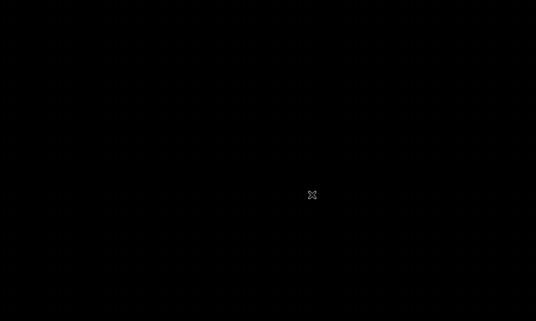

It draws real images in Kitty, Ghostty, iTerm2 and WezTerm, also inside tmux (see [Multiplexers](#multiplexers)). Other terminals get an ASCII face.

## Quick start: draw your own agent

From the project folder:

```bash
~/.pi/agent/git/github.com/testy-cool/pi-agent-portrait/scripts/draw-portrait \
  --name forge --role "a deploy agent"
pi
```

Switch portraits any time inside pi with `/portrait forge`, or `/portrait` alone to pick from a list. The choice is saved for that project and shows straight away.

It writes the set to `.pi/extensions/pi-emote/emotes/forge/` and selects it in that folder's `.pi/extensions/pi-emote/config.json`, so each project can have a different face. It needs Python 3 with Pillow and NumPy, plus one image model:

- **Codex CLI** (`--backend codex`, picked automatically when `codex` is installed): its built-in image tool, on your ChatGPT login.
- **Azure OpenAI** (`--backend azure`): set `AZURE_IMAGE_ENDPOINT` to the full `.../openai/v1/images/edits` URL, plus `AZURE_IMAGE_KEY` and `AZURE_IMAGE_MODEL` (tested with `gpt-image-2` and `gpt-image-2.5`).

## What it reacts to

| | State | When |
|-|-------|------|
| 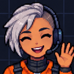 | hi | Session start |
| 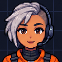 | idle | Nothing happening (blinks now and then) |
| 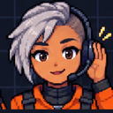 | heard | You sent a message |
| 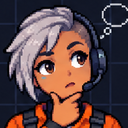 | think | Reasoning tokens streaming |
| 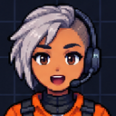 | talk | Reply streaming |
|  | read | `read` tool, or reading tool output |
| 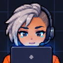 | write | `write` or `edit` tool |
| 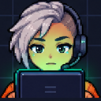 | bash | `bash` tool |
| 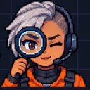 | search | A tool whose name mentions search, web, fetch, browse, scrape or crawl |
| 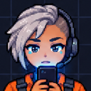 | tool | Any other tool |
| 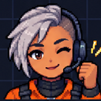 | success | A tool call worked |
| 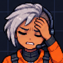 | failure | A tool call failed |
| 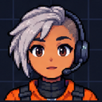 | wait | pi is waiting on a question for you |
| 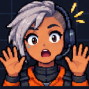 | interrupted | You pressed Esc during a reply |
| 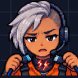 | error | The model request failed |
| 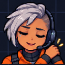 | compact | Context compaction |
| 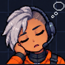 | sleep | Idle for `sleepAfterMs`, 3 minutes by default; 0 turns it off |

A set without frames for one of the newer states shows the closest older one: heard, wait and sleep show idle; bash and search show tool; interrupted and error show failure.

## Examples

Every character below except `default`, `red` and `aza_choi` was drawn with `draw-portrait`, in one run each. The `--direction` text is the whole art brief.

| | Name | Role | Direction |
|-|------|------|-----------|
| 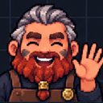 | `forge` | a deploy and ops agent | a grizzled dwarf blacksmith with a braided red beard, leather apron and soot on his cheeks |
| 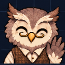 | `quill` | a research agent that reads papers | an elderly owl librarian in a tweed waistcoat with half-moon spectacles |
|  | `nova` | a release manager | a space pilot in her thirties with a short silver undercut, orange flight suit and a headset |
| 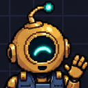 | `sprocket` | a test runner | a small round brass robot with one big glowing teal eye; emotion through the eye and antenna |
| 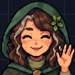 | `moss` | a data cleaning agent | a calm forest witch in her forties with a green hood, freckles and moss in her hair |
|  | `oana` | brand strategy and art direction | drawn from a photo with `--photo-style`, plus a second take with `--variant 2` |
|  | `cipher` | a research agent | a handsome, modular cyborg (an older 19-frame set) |

Try one in any project with `/portrait quill`.

### Community sets

| Avatar | Name | Contributor |
|--------|------|-------------|
|  | `default` | [@cgxeiji](https://github.com/cgxeiji) |
|  | `aza_choi` | [@shennguyenrs](https://github.com/shennguyenrs) |
|  | `aza_choi_nobg` | [@shennguyenrs](https://github.com/shennguyenrs) |
|  | `red` | [@cgxeiji](https://github.com/cgxeiji) |
| `(^ ◡ ^)/` | `ascii` | [@cgxeiji](https://github.com/cgxeiji) |
| `ʕ•̫͡•ʔ` | `ascii-bear` | [@LCorleone](https://github.com/LCorleone) |
| <pre>.------.<br>\|  ^o^ \|<br>'--++--'<br>===++===</pre> | `ascii-bot` | [@cgxeiji](https://github.com/cgxeiji) |

Sets are welcome by PR, see [Custom Emotes](#custom-emotes).

## How drawing works

`draw-portrait` makes one image model call per character. All 30 frames come back on a single sheet, which is what keeps the face, clothes and colours the same in every frame.

**1. It sends a reference sheet and a prompt.** The reference is a 6 by 5 grid with the `default` set's 19 poses and 11 empty cells for the newer states. It shows the model the grid, the framing and the pixel-art style. The prompt describes the new character and lists all 30 poses in order. See both with `--print-reference ref.png` and `--print-prompt`.

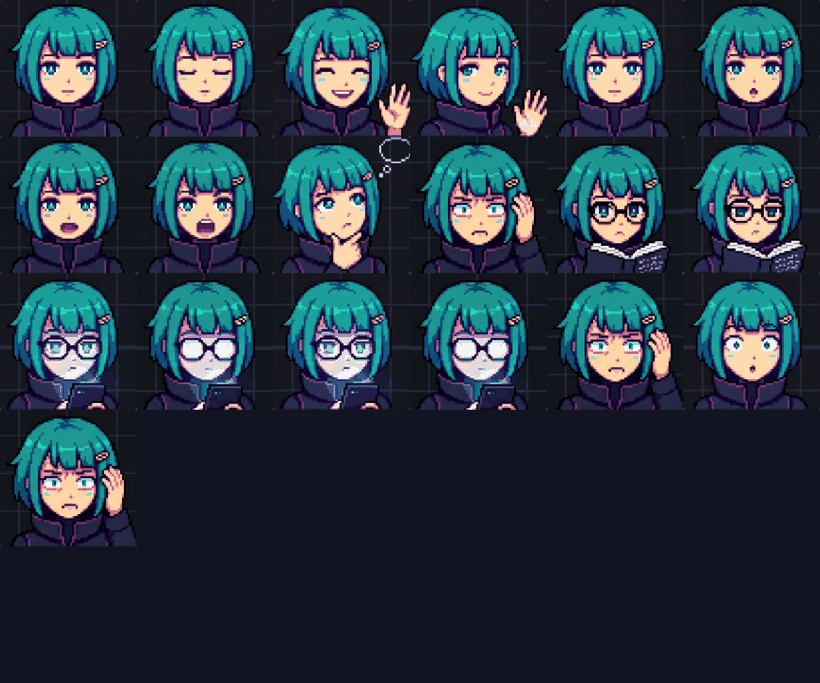

**2. The model draws a new sheet.** The same grid, with the new character in all 30 cells. This is the sheet nova came back with, from a one-line brief:

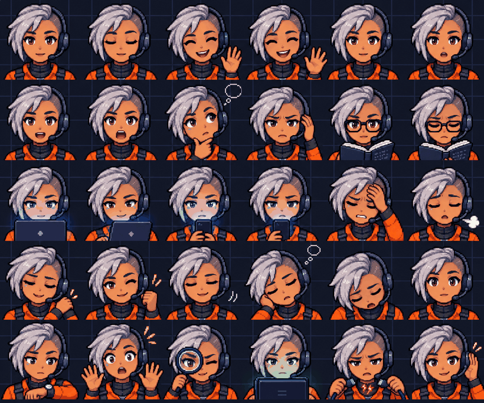

**3. It cuts the sheet into frames and installs them.** It finds where the dark background ends, splits that into 30 equal cells, crops a square from the middle of each and saves it at 128 by 128 under its state, such as `think/think_hard.png`. `--print-guide emotes/nova guide.png` shows every frame with its file name:

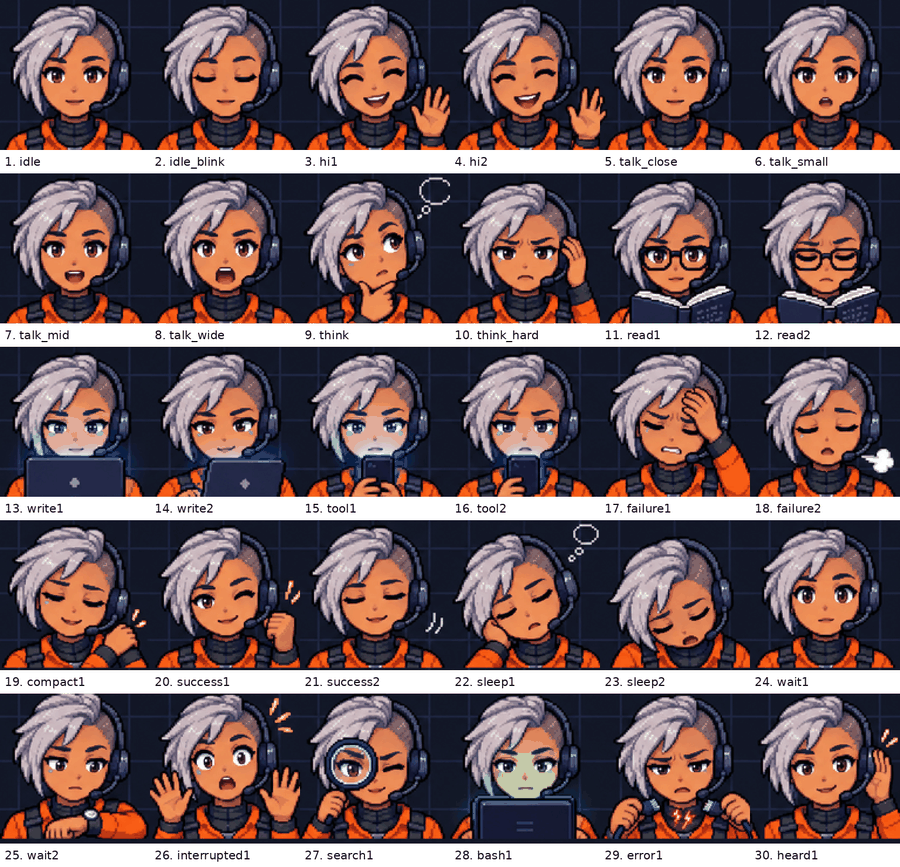

Once a character has all 30 frames, it can be the reference for the next one with `--template emotes/nova`. The model then sees every pose drawn, not 11 empty cells.

## Drawing options

```bash
# a likeness of a real person, from a photo
draw-portrait --name sam --role "my coding buddy" --photo sam.jpg

# the same, drawn in the photo's realistic style instead of the anime default
draw-portrait --name sam --role "my coding buddy" --photo sam.jpg --photo-style

# how the character moves, not only how it looks
draw-portrait --name sam --role "my coding buddy" \
  --direction "finger guns instead of a wave, a pencil behind his ear, one eyebrow cocked"
```

Each cell keeps its meaning (wave, talk, think, read and so on) whatever the direction says, so the right frame still shows for each state.

For the most faithful likeness, first ask an image tool for one pixel-art portrait of the person from their photo, then pass that portrait as `--photo` with `--photo-style`. The default set's anime look otherwise makes adults look younger. Only draw people who are fine with it.

### More takes

`draw-portrait --name <name> --variant 2` draws the same character again in 30 different poses (a salute instead of a wave, binoculars instead of a magnifying glass) and adds them as `<frame>_v2.png`. Take 1's sheet is the character reference, so face, clothes and details stay the same. Each time a state starts the portrait picks one take at random and keeps it until the state ends. Use 3, 4 and so on for more. oana's two takes:

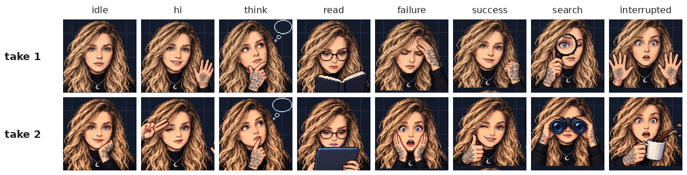

### Without the script

Use any image tool that accepts a reference image, such as ChatGPT:

1. Save the reference sheet: `draw-portrait --print-reference ref.png`.
2. Print the prompt: `draw-portrait --print-prompt --name cipher --role "a research agent"`.
3. Give the tool both, save the image it makes, and install it: `draw-portrait --name cipher --sheet sheet.png`.

The prompt asks for 30 poses on a 6 by 5 grid in a fixed order, so the script knows where each frame is. `--layout 19` installs an older 5 by 4 sheet of 19.

## Config

Drop a `config.json` in one of these paths (highest priority wins):

- `~/.pi/agent/extensions/pi-emote/config.json` — your global prefs
- `.pi/extensions/pi-emote/config.json` — project override

Only include what you want to change:

```json
{
  "size": 12,
  "emotes": [
    { "model": "*claude*", "emote-set": "my-avatar" }
  ]
}
```

See `config.json` in the extension root for all defaults.

### Theme

Customize the widget colors. All fields are optional — omitted fields use the defaults below:

```json
{
  "theme": {
    "model-name": "accent",
    "progress-bar": {
      "default": "text",
      "cache-hit": "success",
      "cache-miss": "error",
      "almost-full": "warning"
    },
    "token-info": "dim",
    "working-directory": "warning",
    "border": "thinking-level-color",
    "vertical-separator": "thinking-level-color"
  }
}
```

- **`model-name`** — model, thinking level, and context window (always bold)
- **`progress-bar`** — token usage and context fill; color follows the context state:
  - `cache-miss`: cache hit rate between 0% and 50% → `error`
  - `almost-full`: context fill ≥ 75% → `warning` (when not a cache-miss)
  - `cache-hit`: cache hit rate ≥ 50% → `success` (when not almost-full)
  - `default`: no cache data yet (0% hit rate on a fresh session) → `text`
- **`token-info`** — input/output tokens, cache hit rate, cost
- **`working-directory`** — current working directory
- **`border`** — top border line
- **`vertical-separator`** — the `│` divider beside the avatar

Each value is either a pi theme color token or the special `thinking-level-color` flag. `thinking-level-color` follows the thinking level's color (the same color the border uses by default), so it shifts live when the thinking level changes — unlike a fixed token like `thinkingHigh`, which pins one specific level's color.

Available theme color tokens: `accent`, `border`, `borderAccent`, `borderMuted`, `success`, `error`, `warning`, `muted`, `dim`, `text`, `thinkingText`, `thinkingOff`–`thinkingMax`, `md*`, `syntax*`, `tool*` (full list in `src/types.ts`). All colors update live when pi's theme changes — no restart needed.

Invalid values are ignored with a warning and fall back to the defaults.

## Multiplexers

pi-emote can render image avatars through **tmux** using DCS passthrough. When tmux is detected, pi-emote auto-detects the outer terminal and picks the right image protocol.

### tmux Setup

Add these to your `tmux.conf`:

```bash
# Required — allow image sequences to pass through to the outer terminal
set -g allow-passthrough on

# Required — detect outer terminal when attaching from a different terminal
set -ga update-environment TERM
set -ga update-environment TERM_PROGRAM

# Recommended — reduces flicker during animation
set -sg escape-time 0
```

Then restart tmux completely:

```bash
tmux kill-server && tmux
```

Without `allow-passthrough`, pi-emote defaults to ASCII and shows a one-time warning with setup instructions.

### Experimental Multiplexer Support

| Outer Terminal | Protocol | Status |
|----------------|----------|--------|
| Ghostty | kitty-unicode | ✅ Stable, pane-safe, auto-detected |
| kitty | kitty-unicode | ⚠️ Untested, pane-safe, auto-detected |
| WarpTerminal | kitty-unicode | ⚠️ Untested, pane-safe, auto-detected |
| iTerm2 | iterm2 | ⚠️ Experimental, opt-in only (pane bleed in multi-pane layouts) |
| WezTerm | iterm2 | ⚠️ Experimental, opt-in only (not verified) |

The outer terminal is detected via `tmux show-environment TERM_PROGRAM`, which reflects the currently attached terminal.

Ghostty and kitty use the **kitty-unicode** renderer (Unicode placeholders) which is pane-safe — images stay within their pane and clean up on session switch. This is the default when auto-detected.

iTerm2 and WezTerm use DCS passthrough for the iTerm2 image protocol. This works but has known limitations: images can bleed into adjacent panes and persist when switching sessions. **Not enabled by default** — opt in explicitly:

```json
{
  "terminals": [
    { "match": "tmux", "render": "iterm2" }
  ]
}
```

### Other Multiplexers

**zellij** and **screen** are not yet supported and default to ASCII.

### Manual Override

Force a specific renderer:

```json
{
  "terminals": [
    { "match": "tmux", "render": "kitty-unicode" }
  ]
}
```

Available render values for tmux: `"auto"`, `"kitty-unicode"`, `"kitty"`, `"iterm2"`, `"ascii"`.

- `"auto"` — detect outer terminal; uses kitty-unicode for Ghostty/kitty, ASCII for others
- `"kitty-unicode"` — pane-safe Unicode placeholders (Ghostty, kitty)
- `"kitty"` — classic DCS passthrough (single-pane only, experimental)
- `"iterm2"` — iTerm2 DCS passthrough (single-pane only, experimental)
- `"ascii"` — text fallback

## Custom Emotes

Emote sets live in `emotes/<set-name>/` with PNG frames per state:

```
emotes/my-avatar/
├── idle/*.png
├── think/*.png
├── talk/*.png
├── read/*.png
├── write/*.png
├── tool/*.png
└── ...          # hi, success, failure, compact, heard, wait, bash, search,
                 # interrupted, error, sleep
```

Not all states are required. Missing ones just won't animate.

### Where to put them

pi-emote searches in order:

1. `.pi/extensions/pi-emote/emotes/<name>/` (project)
2. `~/.pi/agent/extensions/pi-emote/emotes/<name>/` (user)
3. Extension built-in → falls back to `default`

### Map models or thinking levels to sets

Glob patterns against model ID and/or thinking level, last match wins:

```json
{
  "emotes": [
    { "model": "*", "emote-set": "default" },
    { "model": "*claude*", "emote-set": "my-avatar" },
    { "model": "*haiku*", "emote-set": "haiku-avatar" }
  ]
}
```

In this example, `claude` models use `my-avatar`, but `haiku` ones use `haiku-avatar`.

Each entry matches on two dimensions — the model ID and the thinking level (`off`, `minimal`, `low`, `medium`, `high`, `xhigh`, `max`). Unset selectors default to `*`, so existing model-only entries keep working unchanged. An entry matches when **all** of its selectors match; last match wins:

```json
{
  "emotes": [
    { "model": "*claude*", "emote-set": "my-avatar" },
    { "thinking-level": "high", "emote-set": "focused-avatar" }
  ]
}
```

`claude` models get `my-avatar` at any thinking level, while **any** model at high thinking gets `focused-avatar`. To target a specific combination, set both selectors:

```json
{
  "emotes": [
    { "model": "*claude*", "thinking-level": "high", "emote-set": "deep-focus" }
  ]
}
```

This matches only `claude` models thinking at `high` level — anything else falls back to `default`.

Order matters: later entries override earlier ones, so put broad mappings first and refinements last. A warning is logged when two entries clash within the same dimension (two model patterns or two thinking-level patterns both match); a model entry and a thinking-level entry matching together is intentional layering and stays silent.
See `emotes/default/emotes.json` for per-set frame config (blink frames, talk weights).

## License

MIT
